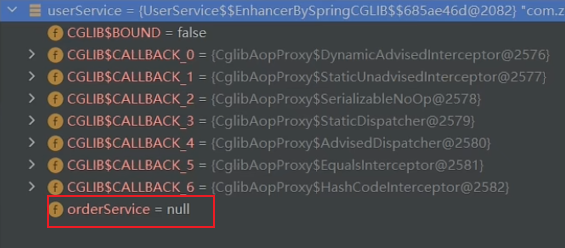
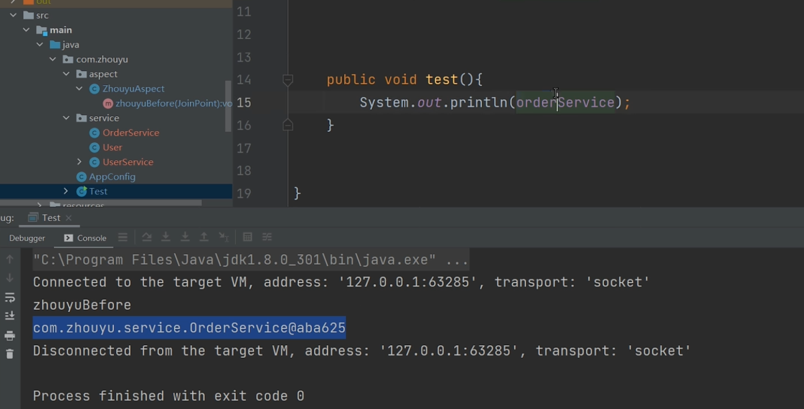
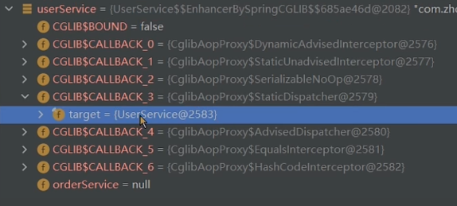

容器启动
BeanDefinition扫描
Bean的生命周期
单例和多例bean
依赖注入
AOP
Aware回调
初始化
BeanPostProcessor

------------------------------------------------------
# spring 底层原理

## 1.Bean生命周期

UserService.class----->无参构造方法(推断构造方法)------>普通对象----->依赖注入--------->初始化前(@PostConstruct)---->初始化------>初始化后(AOP)-------->代理对象---->放入单例池(就是一个map)----------->Bean对象


## 2.推断构造方法

当一个类中有多个构造方法,

Spring会判断这些构造方法中有没有无参构造,如果没有无参构造,那么会报错

```java
@Component
@Scope("singleton")
public class UserService  {

    private OrderService orderService;

//如果有无参构造会优先使用无参构造
    public UserService() {
    }

    public UserService(OrderService orderService) {
        this.orderService = orderService;
    }
    public UserService(OrderService orderService,OrderService orderService1) {
        this.orderService = orderService;
    }
```

```java
@Component
@Scope("singleton")
public class UserService  {

    private OrderService orderService;
//有多个有参构造时,并且没有告诉Spring使用哪个构造方法,那么Spring会报错
//可以使用@Autowired注解告诉Spring使用哪个构造方法
    public UserService(OrderService orderService) {
        this.orderService = orderService;
    }
    public UserService(OrderService orderService,OrderService orderService1) {
        this.orderService = orderService;
    }
```

```java
@Component
@Scope("singleton")
public class UserService  {

    private OrderService orderService;

//如果只有一个构造方法,spring会直接使用该构造方法,同时,这个OrderService参数是有值的
//这个对象是哪里来的呢?
//如果OrderService是一个Bean时候,
//单例时
//Spring会先去单例池中找,如果有直接使用,如果没有就会去创建orderService 这个Bean
//在单例池中怎么找到这个Bean呢? 通过类型(byType),但是单例池中如果有多个OrderService呢?(@Component会创建一个,配置类中@Bean也会创建这样就会有多个OrderService,创建出来的对象的名字是不一样的)
//这时候通过类型(byType)去查找Bean会找到多个Bean,那么该使用哪个呢?
//这个时候就会通过参数名字orderService进行查找
//这就是所谓的先byType再byName
//如果找到多个或者没找到就会报错

//创建时可能会发生循环依赖

//多例时
//Spring不会去单例池中找,直接创建orderService 这个Bean
    public UserService(OrderService orderService) {
        this.orderService = orderService;
    }
    
```


## 3.依赖注入

依赖注入实现需要两步,

1.找到需要注入的属性

2.赋值

```java
//依赖注入
            for (Field field : clazz.getDeclaredFields()) {
                if (field.isAnnotationPresent(Autowired.class)) {
                    field.setAccessible(true);
                    field.set(bean, getBean(field.getName()));
                }
            }
```

依赖注入也是通过先byType再byName

## 4.@PostConstruct  初始化前

在 Spring Boot 项目中，如果你希望在应用启动时自动查库并初始化某个参数，可以使用 @PostConstruct 注解或者实现 ApplicationRunner 接口来完成这个任务。下面是两种常见的实现方式：

方法一：使用 @PostConstruct

这种方式适合在 Spring 管理的 Bean 中执行初始化逻辑。

创建一个服务类，例如 MyService：


```java
java

import org.springframework.beans.factory.annotation.Autowired;

import org.springframework.stereotype.Service;

import javax.annotation.PostConstruct;

@Service

public class MyService {

private String myParameter;
@Autowired
private MyRepository myRepository; // 假设这是你的仓库接口

@PostConstruct
public void init() {
    // 从数据库查询初始化参数
    myParameter = myRepository.findSomeParameter();
    System.out.println("Initialized parameter: " + myParameter);
}

public String getMyParameter() {
    return myParameter;
}
}
```

定义一个 JPA Repository（如果你使用的是 Spring Data JPA）：


```java
java

import org.springframework.data.jpa.repository.JpaRepository;

public interface MyRepository extends JpaRepository<MyEntity, Long> {
String findSomeParameter(); // 自定义查询方法
}
```

方法二：使用 ApplicationRunner

这种方式在 Spring Boot 启动完成后运行，适合需要在应用启动后执行复杂逻辑的场景。

实现 ApplicationRunner 接口：


```java
import org.springframework.beans.factory.annotation.Autowired;

import org.springframework.boot.ApplicationArguments;

import org.springframework.boot.ApplicationRunner;

import org.springframework.stereotype.Component;

@Component

public class StartupRunner implements ApplicationRunner {
@Autowired
private MyRepository myRepository; // 假设这是你的仓库接口

@Override
public void run(ApplicationArguments args) throws Exception {
    // 从数据库查询初始化参数
    String myParameter = myRepository.findSomeParameter();
    System.out.println("Initialized parameter: " + myParameter);
}
}
```

总结

如果只需要在类被初始化时执行一次查询，可以使用 @PostConstruct。
如果需要在应用完全启动后执行某些操作，可以使用 ApplicationRunner。
根据你的具体需求选择合适的方法即可。确保你的数据库连接和相关配置已正确设置，以便在启动时能够成功查询参数。

## 5.初始化

```Java
@Component
@Scope("singleton")
public class UserService implements InitializingBean{


    private String beanName;

    @Autowired
    private OrderService orderService;

    public void test() {
        System.out.println(orderService);
        //


    }

    @Override
    public void afterPropertiesSet() {
        //实现了InitializingBean这个接口之后就可以在spring创建了bean之后做一些事情
        //比如设置一些变量的参数
        System.out.println("初始化");
    }
}
```

Spring在初始化的时候判断创建bean的时候有没有实现InitializingBean这个接口

```Java
//初始化
            if (bean instanceof InitializingBean) {
                ((InitializingBean) bean).afterPropertiesSet();
            }
```


## 6.初始化后(AOP)

动态代理


当使用AOP时,生成的代理对象中需要依赖注入的orderService是没有值的(null)

因为生成初始化后生成代理对象之后并不会再次进行依赖注入,所以代理对象的orderService是没有值的

```java
@Component
@Scope("singleton")
public class UserService implements BeanNameAware, InitializingBean, UserInterface {


    private String beanName;

    @Autowired
    private OrderService orderService;

    public void test() {
        System.out.println(orderService);
        //


    }
```



但是去进行打印的时候并不是null




生成代理对象有两种方式CGlib和JDK自带的

```java
//当执行tset的是其实是执行的普通对象的test.普通对象是进行过依赖注入的,所以orderService是有值的
class UserServiceProxy extends UserService{
  UserService target;//普通对象
  public void test(){
    //切面逻辑@Before
    //target.test;
  }
}
```



## 7.Spring事务

```Java
//开启事务的时候,
class UserServiceProxy extends UserService{
  UserService target;//普通对象
  public void test(){
    //Spring事务切面逻辑
    //判断有没有@Transactional注解,有就开启事务
    //1.事务管理器新建一个数据库连接connect
    //2. connect.autocommit=false
    //target.test; //普通对象.test()   jdbctemplate sql1  sql2  
    //connect.commot() 或者connect.rollback()
  }
}
```

事务失效原理

```Java
@Transactional
public void test(){
  jdbcTemplate.execute("insert into t1 values (1,2)");
  a();
}

@Transactional(propagation=PROPAGATION.NEVER)
public void a(){
  jdbcTemplate.execute("insert into t1 values (2,2)");
}
```

按照写的逻辑是希望当执行test()方法是报错并进行回滚,

但是执行的结果并没有报错,两个sql都会执行成功这是为什么呢?

```Java
//开启事务的时候,
class UserServiceProxy extends UserService{
  UserService target;//普通对象
  public void test(){
    //Spring事务切面逻辑
    //判断有没有@Transactional注解,有就开启事务
    //1.事务管理器新建一个数据库连接connect  ThreadLocal <Map<DataSource,connect>>
    //2. connect.autocommit=false
    //target.test; //普通对象.test() 当执行到test()时,回调用a()方法,但是是普通对象的a()方法,普通对象的a方法是不会有事务的, 所以执行结果并不会按照期望报错回滚
    //connect.commot() 或者connect.rollback()
  }
}
```

如果想要达到希望的结果,可以这样写

```Java
//自己注入自己
@Autowired
    private UserService userService;

@Transactional
public void test(){
  jdbcTemplate.execute("insert into t1 values (1,2)");
  userService.a();//这里就会使用代理对象的a()方法,事务就会生效
}

@Transactional(propagation=PROPAGATION.NEVER)
public void a(){
  jdbcTemplate.execute("insert into t1 values (2,2)");
}
```


事务传播机制

```
REQUIRED(0),
SUPPORTS(1),
MANDATORY(2),
REQUIRES_NEW(3),
NOT_SUPPORTED(4),
NEVER(5),有事务存在就抛异常
NESTED(6);
```

## 8.@Configuration

如果配置类上没有@Configuration注解的话,执行sql的 jdbcTemplate和事务管理器所使用的dataSource对象**不是同一个**, 就会导致事务失效,sql不会回滚.

配置类上加了@Configuration之后执行sql的 jdbcTemplate和事务管理器所使用的dataSource对象**就会是同一个**.

@Configuration  AOP   @Lazy  都是基于动态代理实现的,

```Java
//配置类@Configuration 生成的代理对象的执行逻辑

class AppConfigProxy extends AppConfig{
  AppConfig target;
  
  public void jdbcTemplate(){
    //当执行到这步 Spring会先去容器中找有没有dataSource这个Bean
    //有就直接用
    //没有才会dataSource()去创建
    dataSource()
  }
  public void transactionManager(){
    //当执行到这步 Spring会先去容器中找有没有dataSource这个Bean
    //有就直接用
    //没有才会dataSource()去创建
    dataSource()
  }
  public void dataSource(){}
}
//这样就可以保证jdbcTemplate和事务管理器所使用的dataSource对象是同一个.


```


## 9.循环依赖

| Spring循环依赖                       |
| -------------------------------- |
| 为什么会出现循环依赖?                      |
| 一级缓存singletonObjects(单例池)的作用是什么? |
| 二级缓存earlySingletonObjects的作用是什么? |
| 三级缓存singletonFactories的作用是什么?    |

```Java
@Component
public class UserService{
    
    @Autowired
    private OrderService orderService;
```

```Java
@Component
public class OrderService {

    @Autowired
    private UserService userService;
}
```


```Java
//如果是下面的流程的话就会导致循环依赖无法打破,
//AService 的Bean生命周期
//
//1. 实例化---->普通对象
//2. 依赖注入----->填充BService的代理对象---->在单例池中找BService----->如果没有就创建BService  
//	BService的Bean生命周期
//	2.1. 实例化---->普通对象
//    2.2. 依赖注入----->填充aService的代理对象---->在单例池中找aService  ----->如果没有就创建aService 
//    2.3. 填充其他属性
//    2.4. 做些其他的事情(AOP)---BService的代理对象
//    2.5. BService的代理对象添加到单例池
//3. 填充其他属性
//4. 做些其他的事情(AOP)--->AService的代理对象
//5. 将AService的代理对象添加到单例池
```

```Java
/*
 *  当出现循环依赖的时候,我们可以提前进行AOP
 *  
 *  AService 的Bean生命周期
 *  0. creatingSet.put(AService)
 *  1. 实例化---->AService普通对象--->放入到三级缓存singletonFactories("AService",()->getEarlyBeanReference(beanName,beanDefinition,AService普通对象))
 *  2. 依赖注入----->填充BService的代理对象---->在单例池中找BService ----->如果没有就创建BService  
 *     BService的Bean生命周期
 *     2.1. 实例化---->普通对象
 *     2.2. 依赖注入----->填充aService的代理对象
 *          ----->在单例池中找aService
 *          ----->在creatingSet发现AService,说明出现了循环依赖
 *          ----->在二级缓存earlySingletonObjects中找有没有AService的代理对象
 *          ----->AOP(
 *                      从三级缓存singletonFactories("AService",()->getEarlyBeanReference(beanName,beanDefinition,AService普通对象))
 *                      拿到 lambda表达式 ()->getEarlyBeanReference(beanName,beanDefinition,AService普通对象)
 *                      --->执行 lambda表达式 ()->getEarlyBeanReference(beanName,beanDefinition,AService普通对象)
 *                      --->创建AService的代理对象,由于普通对象还没有进行属性填充,所以这里不能直接放入单例池
 *                   )
 *          ----->放入二级缓存earlySingletonObjects
 *          ----->
 *     2.3. 填充其他属性
 *     2.4. 做些其他的事情(AOP)---BService的代理对象
 *     2.5. BService的代理对象添加到单例池
 *  3. 填充AService普通对象其他属性
 *  4. 在二级缓存earlySingletonObjects中取AService的代理对象
 *  5. 将AService的代理对象添加到单例池
 *  6. creatingSet.remove(AService)
 */
```


## 10.Spring整合Mybatis

